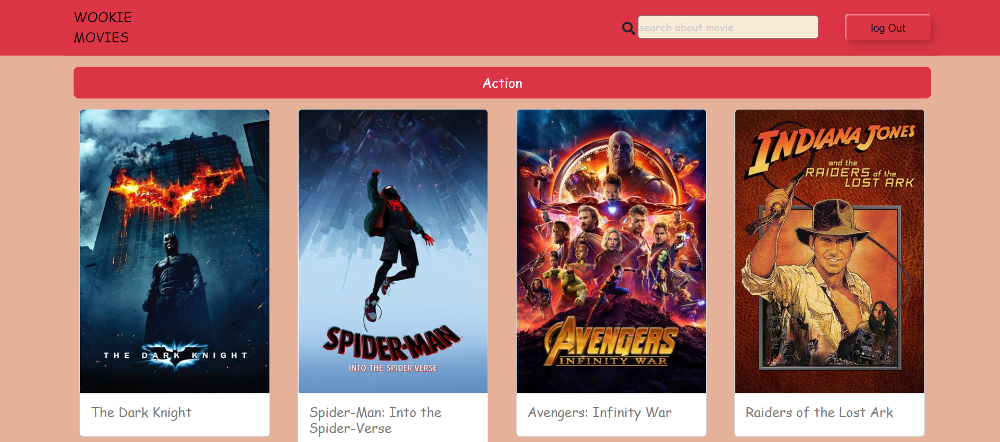
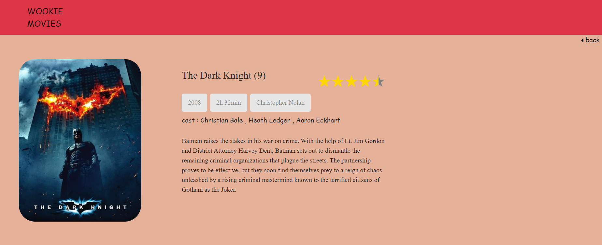
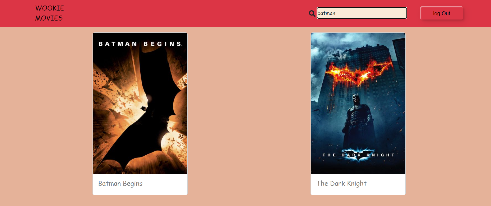

# Wookie Movies - React

### **Home Page (Displays List of movies)**

### **Movie Detail Page (Displays detailed information of movie)**

### **Search Page**

### **login Page**

This project was generated with [React](https://reactjs.org/docs/getting-started.html) version 18.2.0.

### **_Features Implemented_**

- Google authentication used so the user is able to login by google account and the token saved in the cookies . 
- ContextApi ( created to share the data that come from api to avoid multiple api calls and to accelerate the response)
- Pipes (Custom FilterPipe is created to filter images based on group like Action, Drama etc.,)
- Rating (Stars Component is used to display rating of the movie)
- Search (Search Component is used to search the movie typed by the user in the search bar)
- Rest API - GET call Integration
- Bootstrap is used for home page styling. 

## To run the project

- first clone the repository .
- run `npm i` to install all required packages .
- run `npm start` 
- you will be navigating to the browser at `http://localhost:3000`.
- you will see login page that require from you to login by google account .
- after login in , you will be navigating to the home page that includes the movies .
- Enjoy with wookie movies website.

## Running unit tests

Run `npm run test` to execute the unit tests .

